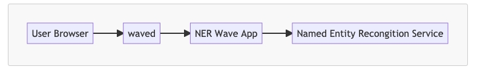
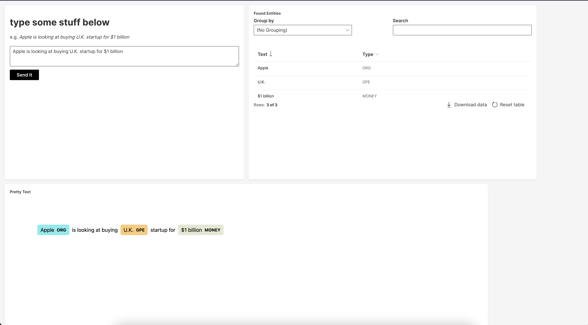

# Named Entity Extraction Microservice Demo

This project exists to demonstrate how a collection of microservices would work together in order to 
present a GUI to a user such that they may view the results of a Named Entity Extraction process on some given text.

## Overview

There are three components to this project:

- [waved](https://wave.h2o.ai/) - a http daemon responsible for presenting a dynamic html GUI, maintain GUI state, and route requests to the [_wave app_](https://wave.h2o.ai/docs/getting-started)
- NER Wave App - the _wave app_ that describes the UI and how requests should be handled given the state of the UI (one may consider this analogous to a Redux Reducer)
- Named Entity Recognition Service - a ([FastAPI](https://fastapi.tiangolo.com/)) http wrapper around the [`scapy`](https://spacy.io/) nlp framework, responsible for consuming the compute requests and formatting the responses 



## Building & Deployment

### Prerequisites
- [docker](http://docker.com/)
- [docker-compose](https://docs.docker.com/compose/)
- amd64 arch (linux or mac or some form of emulation)
- this repo https://github.com/wghilliard/grayson-1700

### Clone the repo

```bash
git clone https://github.com/wghilliard/grayson-1700
cd ./grayson-1700
export REPO_ROOT=$(pwd)
```


### Getting the images
All three services can be built with `docker`, or you may use the prebuilt images available on [docker-hub](https://hub.docker.com/repository/docker/wghilliard/grayson-1700).

(Optional) A 3-line bash script has been included for quickly building the images. 

```bash
cd $REPO_ROOT
./build.sh
```

### Running the images
Next, the included `docker-compose` file will bring the services up in order and bind the necessary port(s) to the host's network interface.

```bash
cd $REPO_ROOT
docker-compose up -d
docker-compose logs -f
```

That's it!

To stop the services, run the following:

```bash
cd $REPO_ROOT
docker-compose down
```

## Usage

The GUI can be found at http://localhost:10101/ner , an example of the UI is shown below:



Also included is a [Postman Collection](https://www.postman.com/) that can be used to interact with the Named Entity Extraction service directly, located at http://localhost:8080/ner .

[grayson-1700.postman_collection.json](./grayson-1700.postman_collection.json)

### todos (unsorted)
- integrate `precommit`
  - black
  - pytest
- optimize scapy pipeline
- error handling (http requests)
- telemetry + structured logs
- add errors to the UI
- better secrets (replace built-in `waved` secrets)
- more better docker networks
- optimize image size
- oauth / identity integration
- ci / cd
- k8s?

### Acknowledgements & Tools
- [JetBrains PyCharm](https://www.jetbrains.com/pycharm/)
- [Anaconda](https://www.anaconda.com/products/individual)
- [MermaidJS](https://mermaid-js.github.io/mermaid/#/)
